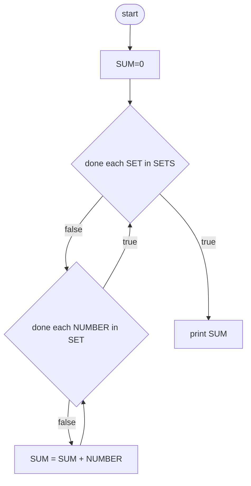

# หาผลรวมของตัวเลขทั้งหมดในเซ็ตของเซ็ตที่มีจำนวนจริงอยู่ 10 ตัว จำนวน 10 เซ็ต

```mermaid
%% Sum all number in 10 sets (SETS) of 10 real numbers
flowchart TD
    s1([start]) --> sum[SUM=0]
    sum --> s2{done each SET in SETS}
    s2 -- false --> s3{done each NUMBER in SET}
    s3 -- false --> s4[SUM = SUM + NUMBER]
    s2 -- true --> print[print SUM]
    s3 -- true --> s2
    s4 --> s3
```

